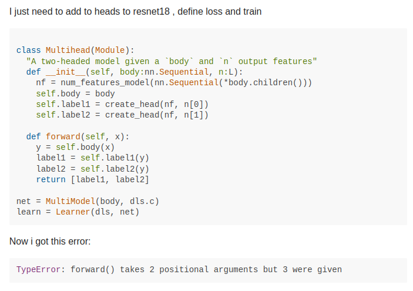

##

## Let's train a model!

```python
from transformers import TrainingArguments, trainer

args = TrainingArguments(...)
model = Model.from_pretrained(...)

trainer = Trainer(args, model)
trainer.train()
```


## It's 3am and this is what you see

```bash
File '...', line xxx
  trainer.train()
File '...', line xxx
  result = self.forward(*input, **kwargs)
File '...', line xxx
  return F.linear(input, self.weight, self.bias)
File '...', line xxx
  ret = torch.addmm(bias, input, weight.t())

RuntimeError: mat1 and mat2 shapes cannot be multiplied
```

## fast.ai, cool right?

```python
from fastai.vision.all import *

set_seed(99, True)
path = untar_data(URLs.PETS)/"images"
dls = ImageDataLoaders.from_name_func(
    path, get_image_files(path), valid_pct=0.2,
    label_func=lambda x: x[0].isupper(), item_tfms=Resize(224)
)
learn = vision_leaner(dls, resnet34)
learn.fine_tune(1)
```

## But the second you try to customize it, something breaks



## High Level Frameworks Come with a Cost

* **For every abstraction a framework does, there's an equivalent cost of control lost**
* Knowing what abstraction you need and how deep it goes only comes with experience
* For beginners, this means an inverse effect. The more we hand-hold, the *harder it is to learn*.

## The Trainer

* With 1 year of PyTorch experience, you may know what a matmul error is
* But, could you find exactly where and how to fix that in the Trainer?

Answer; Likely no

## fast.ai

* The fastai framework itself is built very different from most libraries
* The aim is to lower the barrier to ML and make it "fast" and easy

As someone who has the entire fastai codebase mapped in his head, it's not. And debugging
requires getting deep into the weeds that most beginners get overwhelmed with

# Where does that leave us? Are frameworks bad?

# No, but the training wheels need to come off to move forward

> Nothing in the world is worth having or worth doing unless it means effort, pain, difficulty.

- Theodore Roosevelt

## Top -> down helps you get in

* Play with the code faster
* Get MVP's same-day

But there's the issue of how do you not google every 2 seconds when something breaks

## Getting in the weeds

* The best way to learn is to get familiar with the code, deeply
* Study the source code
* Study the forums
* Understand that outside a set of norms, OOTB solutions **will not work**

## How do I get better?

*Remove the Training Wheels*

Low-Level frameworks **excel** as a teaching vector
* Build foundational knowledge
* Errors are more clear
* Clarify the top-level issues faster

# Wednesday: Why Low-Level Frameworks Save Us