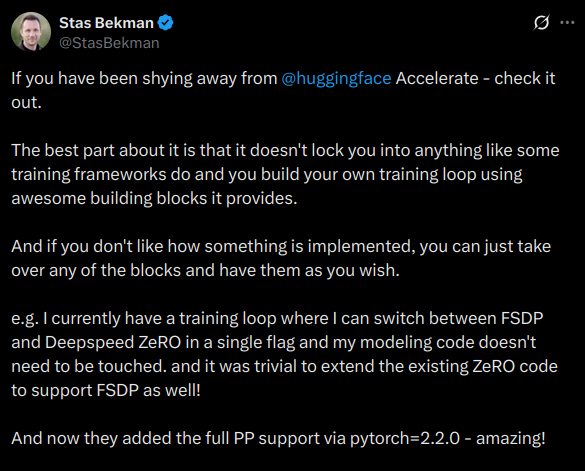

# What is "Low Level"

## What it's *not*

## What it's *not*

* `transformers.Trainer`

## What it's *not*

* `transformers.Trainer`
* `axolotl`

## What it's *not*

* `transformers.Trainer`
* `axolotl`
* `TRL`

## What it's *not*

* `transformers.Trainer`
* `axolotl`
* `TRL`
* `fastai`

## How do we define it?

At the lowest level, nothing gets wrapped


## How do we define it?

At the lowest level, nothing gets wrapped

"Low Level API"'s **just wrap on minimal version**

##  Accelerate

```python
for i, (inputs, labels) in enumerate(training_set):
    predictions = model(inputs)
    loss = loss_function(predictions, labels)
    loss = loss / accumulation_steps
    loss.backward()
    if (i+1) % accumulation_steps == 0:
        optimizer.step()
        optimizer.zero_grad()
        if (i+1) % evaluation_steps == 0:
            evaluate_model()
```

##  Accelerate

```python
for i, (inputs, labels) in enumerate(training_set):
    predictions = model(inputs)
    loss = loss_function(predictions, labels)
    loss = loss / accumulation_steps
    loss.backward()
    if (i+1) % accumulation_steps == 0:
        optimizer.step()
        optimizer.zero_grad()
        if (i+1) % evaluation_steps == 0:
            evaluate_model()
```


```python
accelerator = Accelerator(gradient_accumulation_steps=2)
model, optimizer, training_set = accelerator.prepare(
    model, optimizer, training_set
)
for inputs, labels in training_set:
    predictions = model(inputs)
    loss = loss_function(predictions, labels)
    loss.backward()
    optimizer.step()
    optimizer.zero_grad()
    if (accelerator.step + 1) % evaluation_steps == 0:
        evaluate_model()
```

## What does this mean?

1. We stay in raw PyTorch (or TF or what have you) *as much as possible*
2. This means errors stay as "raw" as possible
3. Teachings stay around the overall idea, rather than fighting the framework

# Why I Love Accelerate
Do I have a bias? Of course

## It's entirely optional
<div style="text-align: center;">
  
</div>

# Learn what you need to, then go back up

## Learn what you need

At the low level, `accelerate` helps teach you:

- What distributed training *is* without needing to actually program it

## Learn what you need

At the low level, `accelerate` helps teach you:

- What distributed training *is* without needing to actually program it
- NCCL/CUDA/alignment issues, without needing to worry about your script having issues

## Learn what you need

At the low level, `accelerate` helps teach you:

- What distributed training *is* without needing to actually program it
- NCCL/CUDA/alignment issues, without needing to worry about your script having issues
- Getting that first distributed 'win", without feeling like the tools did all the heavy lifting (you were still 'involved')

# In doing so, you find passion

## Passion

* By removing the helpers, you tackle the root probelm, and discover which parts you like the 'most'

## Passion

* By removing the helpers, you tackle the root probelm, and discover which parts you like the 'most'
* Slowly you accept more help in more places than others

## Passion

* By removing the helpers, you tackle the root probelm, and discover which parts you like the 'most'
* Slowly you accept more help in more places than others
* You begin a journey to the "T" diagram