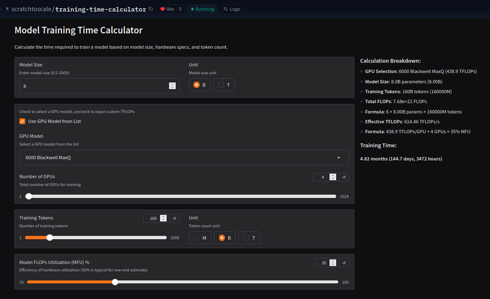
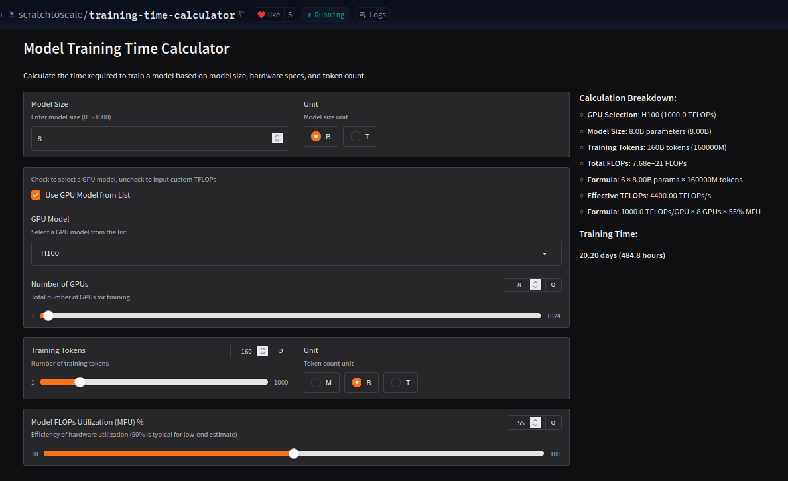
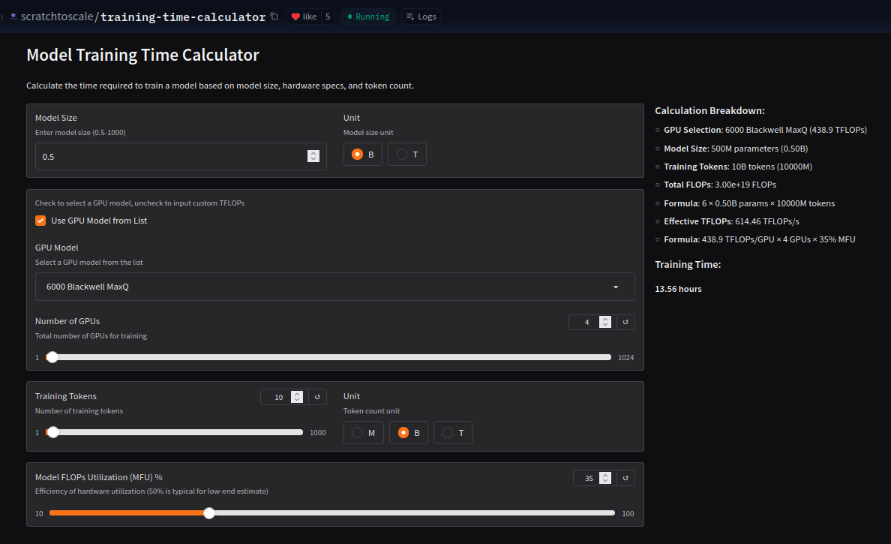
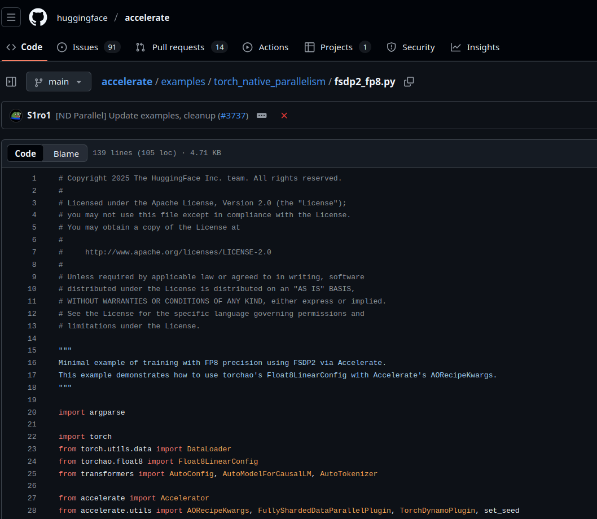
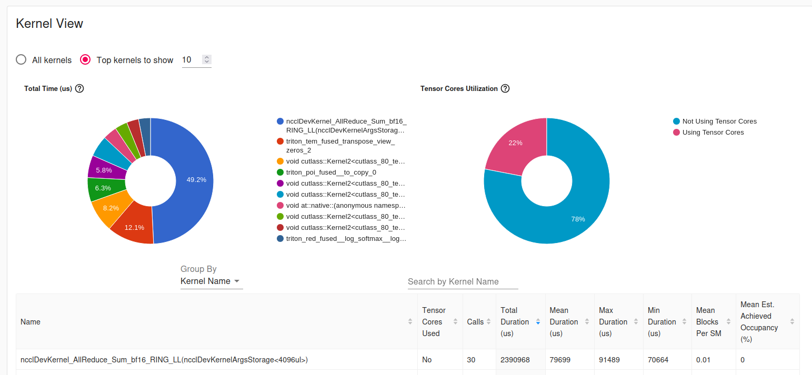
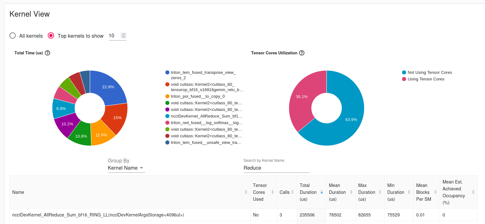

# Motivation

- With the rise of small models, research at home should be a thing

# Motivation

- With the rise of small models, research at home should be a thing
- Personally, pretraining is something I've always wanted to do

# Motivation

- With the rise of small models, research at home should be a thing
- Personally, pretraining is something I've always wanted to do
- I have a genuine love for making things faster

# How fast is fast enough?

## How fast is fast enough?

- ~12 hours total (to Chinchilla)
  - Chinchilla == 20 * XB params
  - Fast enough to test data iterations
  - 2x experiments per day
  - Vastly limits the size of the model I can use
- What models can I use?

## How fast is fast enough?

- MFU at home (~30-35% is doing VERY good)
- 4x RTX 6000 Blackwell Max-Q's
- No NVLink/fancy tricks


## How fast is fast enough?

The Depression Calculator™



## How fast is fast enough?

The Depression Calculator™



## How fast is fast enough?

The Depression Calculator™


## How fast is fast enough?

The Depression Calculator™



# The long road to 13 hours

## The Model

- Qwen3-MoE-500M-A330M
- *Most* of that 330M comes from embeddings
- At a vocab of only 32k it'd be considered Qwen3-MoE-500M-A120M

```yaml
model_type: qwen3_moe
architectures: ["Qwen3MoeForCausalLM"]

vocab_size: 151936
hidden_size: 896
num_hidden_layers: 12
num_attention_heads: 16
num_key_value_heads: 16
hidden_act: silu

# === MoE ===
num_experts: 16
num_experts_per_tok: 2
moe_intermediate_size: 512

# === Dense MLP baseline ===
intermediate_size: 4096
```

## Establish a baseline on the smallest node possible

- Focus on saving $$$
- Focus on saving **time**
- Ensure that small variations work then scale

## Establish a baseline on the smallest node possible



## Establish a baseline on the smallest node possible

Raw BF16 using a core script:

- Batch size of 12
- Iterates through 200 batches 
- Sequence length of 4096
- 9.8M tokens

Results:

- 44,942 tok/s
- Time to 10B tokens: **61.80 hours**


## Is maximum batch size worth it?

- Batch size of 8
- Sequence length of 4096
- 6.5M tokens

Results:

- <s>44,942</s> 45,005 tok/s
- Time to 10B tokens: <s>61.80 hours</s> **61.72 hrs**


## Is maximum batch size worth it?


## Let's try a different attention mechanism

```python
    model = AutoModelForCausalLM.from_config(
        AutoConfig.from_pretrained("./config.json", use_cache=False),
        torch_dtype=torch.bfloat16,
        attn_implementation="flex_attention"
    )
```

Results:

- <s>45,005</s> 59,037 tok/s
- Time to 10B tokens: <s>61.80 hours</s> **47.5 hrs**

## Could it be the data?


## Simple test: pin_memory=True


<!-- ## Simple test: pin_memory=True


Results:

- <s>59,037</s> 59,207 tok/s
- Time to 10B tokens: <s>47.5 hours</s> **46.91 hrs** -->

## What if we minimize the CPU whatsoever?


## What if we minimize the CPU whatsoever?

Pin memory:

- <s>59,037</s> 59,207 tok/s
- Time to 10B tokens: <s>47.5 hours</s> **46.91 hrs**

## What if we minimize the CPU whatsoever?

Pin memory:

- <s>59,037</s> 59,207 tok/s
- Time to 10B tokens: <s>47.5 hours</s> **46.91 hrs**

Pre-tokenize:

- <s>59,037</s> 62,840 tok/s
- Time to 10B tokens: <s>46.91 hours</s> **44.2 hrs**


<!-- ## Let's play with the data more: CUDA Buffers -->

<!-- ```python
    for step, batch in enumerate(dataloader):
        if step >= total_num_steps:
            break
        with torch.cuda.stream(prefetch_stream):
            next_batch = {
              k: v.to(
                device=accelerator.device, non_blocking=True
                )
              for k, v in batch.items()}
        torch.cuda.current_stream().wait_stream(prefetch_stream)
        batch = next_batch
        with record_function("forward"):
            outputs = model(**batch)
            loss = outputs.loss
``` -->

## Let's play with the data more: CUDA Buffers (before)


## Let's play with the data more: CUDA Buffers (after)


## Let's play with the data more: CUDA Buffers

```python
for step, batch in enumerate(dataloader):
    if step >= total_num_steps:
        break
    with torch.cuda.stream(prefetch_stream):
        next_batch = {
          k: v.to(
            device=accelerator.device, non_blocking=True
            )
          for k, v in batch.items()}
    torch.cuda.current_stream().wait_stream(prefetch_stream)
    batch = next_batch
    outputs = model(**batch)
    loss = outputs.loss
```

Results (not helpful):

- <s>62,840</s> 57,003 tok/s
- Time to 10B tokens: <s>44.2 hrs</s> **48.73 hrs**


## Out of data ideas, the optimizer!


## Let's fuse a kernel (thanks to Claude)


## Let's fuse a kernel (thanks to Claude)

```python
class Qwen3MoeMLP(nn.Module):
    def __init__(self, config, intermediate_size=None):
        ...

    def forward(self, x):
        out = self.act_fn(self.gate_proj(x))
        out *= self.up_proj(x)
        down_proj = self.down_proj(out)
        
        return down_proj
```

## Let's fuse a kernel (thanks to Claude)

```python
class Qwen3MoeMLP(nn.Module):
    def __init__(self, config, intermediate_size=None):
        ...

    def forward(self, x):
        # single GEMM → splits into gate and up
        gate_up = self.gate_up_proj(x)
        gate, up = gate_up.chunk(2, dim=-1)
        out = self.down_proj(self.act_fn(gate) * up)
        return out
```

# We've graduated to Multi-GPU!

## Distributed Data Parallel

- See a linear-ish speedup
- 1 -> 4 GPUs, keeping local batch size

- 19.6M tokens seen across 200 batches

Results (vs baseline):

- <s>45,005</s> 118,168 tok/s
- Time to 10B tokens: <s>61.72 hrs</s> **23.5 hrs**

## Applying all our earlier tricks (bar modeling tricks)

Results:

- <s>118,168</s> 154,870 tok/s
- Time to 10B tokens: <s>23.5 hrs</s> **17.94 hrs**

Now we're doing **really good**

What's our bottleneck?

## Applying all our earlier tricks (bar modeling tricks)



## Applying all our earlier tricks (bar modeling tricks)

The 0.08s/all_reduce (on PCIe4, 0.04s on PCIe5)

- 10B / (6 * 4 * 4096) = 98,304 tok/batch
- 10B / 98,304 = 101,725 batches
- 0.08 * 101,725 = **2.26 hours purely on AllReduce**

## Achieving the target batch size

- Recommended to have a batch token amount of 1M
- Equates to ~grad accum of 10




## Achieving the target batch size


- Recommended to have a batch token amount of 1M
- Equates to ~grad accum of 10
- <s>154,870</s> 210,377 tok/s
- Time to 10B tokens: <s>17.94 hrs</s> **13.2 hrs**

# Let's Recap


## Step 1: Optimize Single GPU

- Optimal batch size
- `pin_memory=True`
- Offline data
- CUDA Buffers (showed improvement in multi-GPU)
- `AdamW(fused=True)`
- Fused GEMM

- 44,942 -> 63,627 tok/s (41.57% speedup)
- Time to 10B tokens: 61.80 hours -> **43.67 hours**


## Step 1: Optimize Single GPU


## Step 1: Optimize Single GPU


## Step 2: Optimize Multi-GPU

- Verify single GPU results align at scale
- Minimize comms as much as possible
- Saturate ~1M tok/batch using gradient accumulation

- 63,627 -> 154,870 -> 210,377 tok/s (230% | 35.85%)
- 43.67  -> 17.94  -> **13.2 hours**


## Step 2: Optimize Multi-GPU


## Step 2: Optimize Multi-GPU


# Thanks for coming!